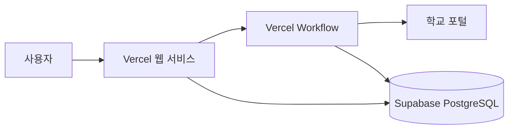

# CBU Dorm Automation

한국공학대학교 생활관 외박신청을 날짜 선택만으로 처리하는 비공식 자동화 서비스입니다.

[서비스 열기](https://tuk-overnight.vercel.app)

학교 포털 로그인은 열려 있지만 동아리 내부 사용을 전제로 운영합니다. 학교 포털 정책이나 화면이
바뀌면 연동이 중단될 수 있으며, 이 프로젝트는 한국공학대학교의 공식 서비스가 아닙니다.

## 제공 기능

- 학교 포털 아이디·비밀번호를 사용하는 일반 로그인 화면
- 달력에서 여러 날짜를 직접 선택하고 연속일은 최대 7박 8일씩 묶어 신청
- 학기·6개월·12개월 퇴관일까지 매일, 평일, 금·토·일 주말 또는 지정 요일 자동 선택
- 기존 신청과 겹치는 날짜 자동 제외
- 학교 신청내역과 최근 작업 결과를 날짜별 색·기호로 달력에 표시
- 브라우저를 닫아도 이어지는 작업, 최근 결과 조회와 남은 신청 중단
- 휴대폰 하단 신청 버튼과 데스크톱 2열 화면을 갖춘 반응형 UI

## 처리 흐름



학교 계정은 서버 전용 키로 AES-256-GCM 암호화한 뒤 Supabase에 저장합니다. 신청할 때마다
학교 SSO에 로그인하며, 같은 작업의 여러 기간은 가능한 한 한 세션에서 연속 처리합니다. 브라우저는
데이터베이스나 복호화 키에 직접 접근하지 않습니다.

## 실행 방식

| 방식 | 위치 | 용도 |
| --- | --- | --- |
| 클라우드 서비스 | `cloud/` | Vercel, Supabase, Workflow 기반 다중 사용자 운영 |
| 로컬 서비스 | `service/` | Node.js와 SQLite로 한 컴퓨터에서 운영 |
| Chrome 확장 | `extension/` | 로그인된 학교 탭을 이용해 비밀번호를 별도 저장하지 않는 방식 |

### 로컬에서 실행

Node.js 24 이상이 필요합니다.

```sh
npm run service
```

실행 후 `http://127.0.0.1:8787`에서 로그인하고 날짜를 선택합니다. 로컬 DB와 암호화
키는 `service/data/`에 생성되며 Git에 포함되지 않습니다.

### 검증

```sh
npm ci --prefix cloud --ignore-scripts
npm test
npm run build
```

클라우드 저장소 테스트는 별도의 테스트 PostgreSQL 주소가 있을 때만 실행됩니다. 실제 계정을
사용한 검증에서는 학교 로그인, 입주·학기·기존 신청 조회, 단건 저장, 저장 후 재조회와
Supabase 완료 기록까지 확인했습니다.

퇴관일은 사용자별로 저장하지 않습니다. `extension/core.mjs`의 학기별 공식 입주기간 표를
사용하며, 다음 학기 일정이 공지되기 전에는 날짜를 추측해 자동 신청하지 않습니다.

## 운영 시 주의사항

- `OVERNIGHT_MASTER_KEY`와 데이터베이스 접속 정보는 서버 비밀값으로만 관리합니다.
- 암호화는 저장 데이터 유출 위험을 줄이지만, 운영 서버는 신청을 위해 계정을 복호화할 수 있습니다.
- 같은 요청의 중복 실행을 막기 위해 작업 ID와 계정별 잠금을 사용합니다.
- 저장 응답이 불명확하면 자동 재시도하지 않고 `확인 필요`로 남겨 중복 신청을 방지합니다.
- 공개 서비스 전에는 학교 정책, 개인정보 처리 기준과 운영 책임 범위를 별도로 확인해야 합니다.

배포 환경변수와 복구 절차는 [클라우드 운영 안내](cloud/DEPLOY.md), 로컬 백업과 장애 대응은
[로컬 운영 안내](service/OPERATIONS.md)를 참고하세요.

## 라이선스와 참고 구현

MIT 라이선스로 배포합니다. 이 저장소에는 MIT 라이선스의
[AUTO-Overnight/Auto_Overnight](https://github.com/AUTO-Overnight/Auto_Overnight)를 바탕으로 한
코드가 포함되어 있으며, 원 저작권 고지는 [LICENSE](LICENSE)에 유지합니다.
