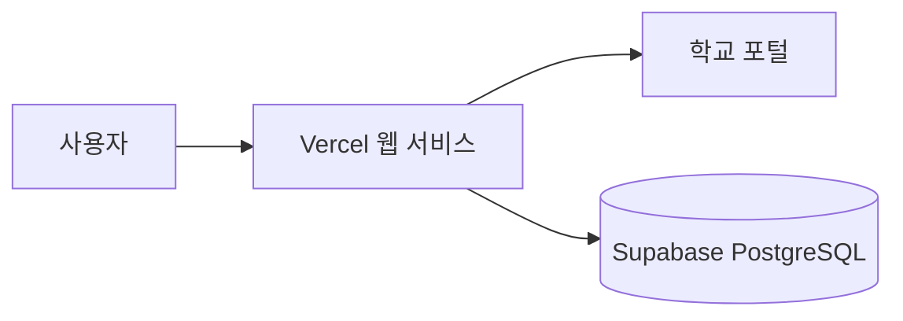

# CBU Dorm Automation

한국공학대학교 생활관 외박신청을 날짜 선택만으로 처리하는 비공식 자동화 서비스입니다.

[서비스 열기](https://cbudorm.vercel.app)

학교 포털 로그인은 열려 있지만 동아리 내부 사용을 전제로 운영합니다. 학교 포털 정책이나 화면이
바뀌면 연동이 중단될 수 있으며, 이 프로젝트는 한국공학대학교의 공식 서비스가 아닙니다.

## 제공 기능

- 학교 포털 아이디·비밀번호를 사용하는 일반 로그인 화면
- 달력에서 여러 날짜를 직접 선택하고 연속일은 최대 7박 8일씩 묶어 신청
- 오늘 포함 1주·2주·31일 동안 매일, 평일, 금·토·일 주말 또는 지정 요일 자동 선택
- 공공데이터포털 공휴일을 달력에 표시하고 `평일 전체`에서 자동 제외
- 기존 신청과 겹치는 날짜 자동 제외
- 학교 신청내역과 최근 작업 결과를 날짜별 색·기호로 달력에 표시
- 불명확한 결과를 학교 신청내역과 읽기 전용으로 다시 대조
- 현재 요청 안에서 처리되는 신청, 최근 결과 조회와 확인 필요 결과 대조
- 휴대폰 하단 신청 버튼과 데스크톱 2열 화면을 갖춘 반응형 UI

## 처리 흐름



학번과 비밀번호는 브라우저 메모리에서 현재 페이지를 사용하는 동안만 유지하고, 학교 포털 요청이
끝나면 서버에도 남기지 않습니다. Supabase에는 계정 HMAC, 세션 해시와 신청 결과만 저장합니다.
새로고침하거나 브라우저를 다시 열면 다시 로그인해야 하며 학교 신청의 백그라운드 재시도는 하지
않습니다. 사용자 계정이 필요 없는 공휴일 정보만 Vercel Cron으로 하루 한 번 갱신합니다.

## 실행 방식

| 방식 | 위치 | 용도 |
| --- | --- | --- |
| 클라우드 서비스 | `cloud/` | Vercel과 Supabase 기반 다중 사용자 운영 |
| 로컬 서비스 | `service/` | Node.js와 SQLite로 한 컴퓨터에서 운영 |
| Chrome 확장 | `extension/` | 로그인된 학교 탭을 이용해 비밀번호를 별도 저장하지 않는 방식 |

### 로컬에서 실행

Node.js 24 이상이 필요합니다.

```sh
npm run service
```

실행 후 `http://127.0.0.1:8787`에서 로그인하고 날짜를 선택합니다. 로컬 DB와 계정 HMAC용
서버 키는 `service/data/`에 생성되며 Git에 포함되지 않습니다.

### 검증

```sh
npm ci --prefix cloud --ignore-scripts
npm test
npm run build
```

클라우드 저장소 테스트는 별도의 테스트 PostgreSQL 주소가 있을 때만 실행됩니다. 실제 계정을
사용한 검증에서는 학교 로그인, 입주·기존 신청 조회, 단건 저장, 저장 후 재조회와
Supabase 완료 기록까지 확인했습니다.

달력 직접 선택과 자동 선택 모두 오늘 포함 31일 안에서만 허용하며, 서버에서도 범위를 다시
검증합니다. 연속된 날짜는 학교 제한에 맞춰 최대 7박 8일씩 묶어 신청합니다.

## 운영 시 주의사항

- `OVERNIGHT_MASTER_KEY`와 데이터베이스 접속 정보는 서버 비밀값으로만 관리합니다.
- `DATA_GO_KR_SERVICE_KEY`와 `CRON_SECRET`도 Vercel Production Secret으로만 관리합니다.
- 학교 포털 아이디·비밀번호는 DB, 로그, 브라우저 저장소에 저장하지 않습니다. 브라우저 비밀번호
  관리자의 저장 여부는 사용자의 브라우저 설정을 따릅니다.
- Vercel 요청은 최대 4분 동안 신청을 처리합니다. 시간 안에 끝나지 않은 날짜는 미처리로 남아
  다음 로그인에서 필요한 날짜만 다시 신청할 수 있습니다.
- 같은 요청의 중복 실행을 막기 위해 작업 ID와 계정별 잠금을 사용합니다.
- 저장 응답이 불명확하면 자동 재시도하지 않고 `확인 필요`로 남겨 중복 신청을 방지합니다.
- 공개 서비스 전에는 학교 정책, 개인정보 처리 기준과 운영 책임 범위를 별도로 확인해야 합니다.

배포 환경변수와 복구 절차는 [클라우드 운영 안내](cloud/DEPLOY.md), 로컬 백업과 장애 대응은
[로컬 운영 안내](service/OPERATIONS.md)를 참고하세요.

## 라이선스와 참고 구현

MIT 라이선스로 배포합니다. 이 저장소에는 MIT 라이선스의
[AUTO-Overnight/Auto_Overnight](https://github.com/AUTO-Overnight/Auto_Overnight)를 바탕으로 한
코드가 포함되어 있으며, 원 저작권 고지는 [LICENSE](LICENSE)에 유지합니다.
