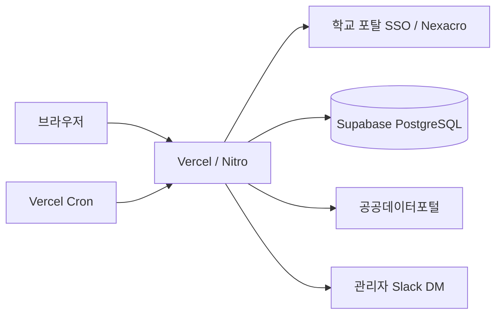

# CBU Dorm Automation

한국공학대학교 생활관 외박신청을 날짜 선택으로 처리하는 웹 서비스입니다.

[서비스 열기](https://cbudorm.vercel.app)

개발동아리 CBU 내부 사용을 위해 운영하는 비공식 서비스입니다. 학교 포탈의 SSO 로그인과
Nexacro 조회·신청 요청을 서버에서 직접 처리합니다.

## 사용 흐름

1. 학교 포탈 아이디와 비밀번호로 로그인합니다. 기존 신청 날짜가 달력에 표시됩니다.
2. 기본 탭인 **자동 선택**에서 신청할 날과 반복 기간을 고르거나, **달력 직접 선택**에서 날짜를 누릅니다.
3. 달력과 확인 대화상자에서 신청할 날짜를 확인한 뒤 제출합니다.
4. 완료·제외·미처리·확인 필요 결과를 대화상자와 달력에서 확인합니다.

자동 선택 규칙은 여러 개를 함께 고를 수 있으며, 겹치는 날짜는 한 번만 포함합니다.

| 선택 규칙 | 대상 날짜 |
| --- | --- |
| 매일 | 선택한 기간의 모든 날 |
| 평일 | 공휴일을 제외한 월요일부터 금요일 |
| 주말 | 금요일부터 일요일 |
| 요일 지정 | 사용자가 고른 요일 |
| 공휴일 | 이번 달 공휴일과 각 공휴일의 전날 |

반복 기간은 오늘 포함 **1주(7일), 2주(14일), 1달(31일)**입니다. 공휴일만 선택하면 반복 기간 없이
이번 달을 기준으로 계산합니다. 모든 방식에서 지난 날짜, 오늘부터 31일 범위 밖의 날짜와 기존
신청일은 제외합니다. 연속된 날짜는 최대 **7박 8일**씩 묶어 학교에 순서대로 요청합니다.

화면은 모바일과 데스크톱에 맞춰 구성되며, 모바일 하단 신청 버튼, 비밀번호 표시 전환,
라이트·다크 모드를 지원합니다. 최근 신청 결과 목록은 별도로 표시하지 않고, 내부 작업 기록을
복구와 결과 재확인에 사용합니다. 서비스 기록 삭제는 학교에 제출한 신청을 취소하지 않습니다.

## 시스템 구성

Node.js 24와 ES 모듈을 사용합니다. 화면은 HTML·CSS·JavaScript로 구성하고, 클라우드는
Nitro로 빌드합니다. 학교 연동과 HTTP API는 클라우드와 로컬 서비스가 공유합니다.


```mermaid
flowchart LR
    U[브라우저] --> V[Vercel / Nitro]
    V --> P[학교 포탈 SSO / Nexacro]
    V --> S[(Supabase PostgreSQL)]
    C[Vercel Cron] --> V
    V --> H[공공데이터포털]
    V --> L[관리자 Slack DM]
```

```text
service/
  public/                 공통 웹 화면, 클라이언트 코드, CBU 이미지
  server.mjs              공통 HTTP API와 로컬 서버 진입점
  portal.mjs              학교 SSO 로그인과 Nexacro 조회·신청
  store.mjs               로컬 SQLite 저장소
  crypto.mjs              계정 HMAC과 세션 보호
  backup.mjs              로컬 DB 백업
  OPERATIONS.md           로컬 운영·복구 안내
cloud/
  index.mjs               클라우드 진입점과 공통 API 연결
  runtime.mjs             PostgreSQL 연결 설정
  store.mjs               클라우드 PostgreSQL 저장소
  holidays.mjs            공휴일 수집과 갱신
  operations.mjs          상태 검사와 Slack 일일 리포트
  supabase/migrations/    DB 스키마·권한 변경 이력
  vercel.json             배포와 Cron 설정
  DEPLOY.md               클라우드 배포·운영 안내
extension/
  core.mjs                공통 날짜 검증과 연속일 묶기
  manifest.json           Chrome 확장 설정
  popup.html, popup.js    로그인된 학교 탭을 이용하는 별도 팝업
```

Chrome 확장은 학교 통합정보시스템 탭에 로그인한 상태에서 쓰는 별도 실행 방식입니다.
팝업에서 시작일·종료일을 입력해 신청 가능 여부를 확인하고 제출합니다.

## 인증과 신청 처리

학교 아이디와 비밀번호는 현재 페이지의 메모리와 학교 요청을 처리하는 동안의 서버 메모리에서만
사용합니다. 서비스 DB, 로그, 세션 쿠키, 브라우저 저장소에는 저장하지 않습니다. 새로고침하거나 페이지를 다시
열면 다시 로그인해야 합니다.

보호 API는 HttpOnly 세션 쿠키와 페이지 메모리의 `X-Session-Proof`를 함께 확인합니다.
세션은 로그인 후 8시간에 만료되며, 클라우드 HTTPS에서는 Secure·SameSite=Strict 쿠키를 사용합니다.

Supabase에는 계정 HMAC, 세션 토큰 해시, 신청 작업·결과, 실행 잠금, 요청 제한, 공휴일과 운영
기록을 저장합니다. 일별 로그인 집계는 계정 HMAC과 한국시간 날짜를 사용합니다.
서버 전용 `overnight_app` 역할이 transaction pooler로 `overnight_private` 스키마에 연결하고,
마이그레이션은 RLS를 강제하며 `anon`·`authenticated` 접근을 차단합니다. 인증은 학교 로그인과
자체 세션으로 처리합니다.

신청 전에 서버가 날짜 범위를 검증하고 10분간 유효한 서명된 계획을 만듭니다. 제출 시 작업 ID와
계정별 잠금으로 중복 실행을 막고, 하나의 요청에서 최대 4분 동안 학교 신청을 처리합니다.
학교에 저장하기 직전 결과를 `unknown`으로 기록한 뒤 재조회에서 확인되면 `saved`로 변경합니다.

| 결과 | 의미 |
| --- | --- |
| `saved` | 학교 내역에서 접수 확인. 학교의 최종 승인과는 별개 |
| `exists` / `overlap` | 이미 신청했거나 기존 신청과 겹쳐 제외 |
| `unknown` | 저장 결과가 불명확하여 재확인 필요 |
| `not_attempted` | 미처리. 필요한 날짜만 다시 신청 가능 |

불명확한 저장 요청은 자동 재전송하지 않습니다. **결과 다시 확인**은 학교 신청내역을 읽어 결과만
대조합니다. 강제 종료된 작업도 기록을 통해 복구하며, 학교 신청의 백그라운드 재시도는 수행하지 않습니다.

## 로컬 실행

Node.js 24 이상이 필요합니다.

```sh
npm run service
```

기본 주소는 `http://127.0.0.1:8787`입니다. 로컬 DB와 서버 키는 `service/data/`에 생성되며
Git에 포함되지 않습니다. 기존 로컬 계정은 이 주소에서 다시 로그인할 수 있습니다.

새 DB에서 첫 계정을 만들 때는 아래처럼 일회용 setup 토큰을 지정합니다. 터미널에 표시된 최초
로그인 주소를 열고 학교 계정으로 로그인합니다. 이후에는 일반 주소를 사용합니다.

```sh
export OVERNIGHT_SETUP_TOKEN="$(node --input-type=module -e 'import { randomBytes } from "node:crypto"; process.stdout.write(randomBytes(32).toString("hex"))')"
printf '최초 로그인 주소: http://127.0.0.1:8787/#setup=%s\n' "$OVERNIGHT_SETUP_TOKEN"
npm run service
```

백업과 복구 절차는 [로컬 운영 안내](service/OPERATIONS.md)를 참고하세요.

## 클라우드 배포와 정기 작업

Vercel 프로젝트의 Root Directory는 `cloud`이며, `service`와 `extension/core.mjs`도 빌드에
포함해야 합니다. Supabase 마이그레이션을 파일명 순으로 적용하고, 서버 환경변수를 설정한 뒤
소스에서 빌드합니다. 설정 예시는 [cloud/.env.example](cloud/.env.example), 배포 순서와 키 관리는
[클라우드 운영 안내](cloud/DEPLOY.md)에 정리했습니다.

`cloud/vercel.json`의 Cron은 다음 작업을 실행합니다. 아래 시간은 한국시간 기준 설정이며,
실제 실행 시각은 배포 플랫폼에 따라 달라질 수 있습니다. 호출에는 `CRON_SECRET` 인증이 필요합니다.

| 작업 | 설정 시간 | 경로 |
| --- | --- | --- |
| 웹·DB 상태 검사 | 03·09·15·21시대 | `/api/cron/health` |
| 공휴일 갱신 | 매일 03시대 | `/api/cron/holidays` |
| 관리자 Slack DM | 매일 00시대 | `/api/cron/report` |

공휴일 갱신은 현재 연도와 다음 연도를 공공데이터포털에서 읽어 한 트랜잭션으로 교체합니다.
조회가 실패하면 기존 데이터를 유지합니다. Slack 리포트는 전날의 로그인 사용자 수와 신청 결과,
발송 시점의 서비스 상태, 최근 정기 작업을 집계합니다. 전송 결과가 불명확하면 자동 재발송하지 않습니다.
일별 로그인과 일반 운영 기록은 90일 보관합니다.

Slack 연동은 [앱 manifest](cloud/slack-app-manifest.json)의 `chat:write`·`im:write` 권한과
`OVERNIGHT_SLACK_BOT_TOKEN`, `OVERNIGHT_SLACK_USER_ID` 설정을 사용합니다.

## 개발 검증

```sh
npm ci --prefix cloud --ignore-scripts
npm test
npm run build
```

`npm test`는 날짜 계산, 학교 응답 파싱, SQLite 저장·복구, HTTP 인증, UI, 공휴일과 운영 리포트를
검증합니다. 학교·공공데이터·Slack 요청은 테스트용 응답으로 대체하며 실제 신청이나 DM을 보내지 않습니다.
`npm run build`는 클라우드 배포물을 만들고 Node.js 24 런타임, 함수 제한 시간과 이미지 포함을 확인합니다.

클라우드 DB 통합 테스트는 `CLOUD_TEST_DATABASE_URL`이 있을 때만 실행하고, 없으면 건너뜁니다.
테스트용 스키마·역할·DB를 만들고 삭제하므로 일회용 PostgreSQL만 사용해야 합니다.

```sh
CLOUD_TEST_DATABASE_URL=postgresql://TEST_USER@127.0.0.1:TEST_PORT/postgres npm run test:cloud
```

## 라이선스와 참고 구현

MIT 라이선스로 배포합니다. 이 저장소에는 MIT 라이선스의
[AUTO-Overnight/Auto_Overnight](https://github.com/AUTO-Overnight/Auto_Overnight)를 바탕으로 한
코드가 포함되어 있으며, 원 저작권 고지는 [LICENSE](LICENSE)에 유지합니다.
